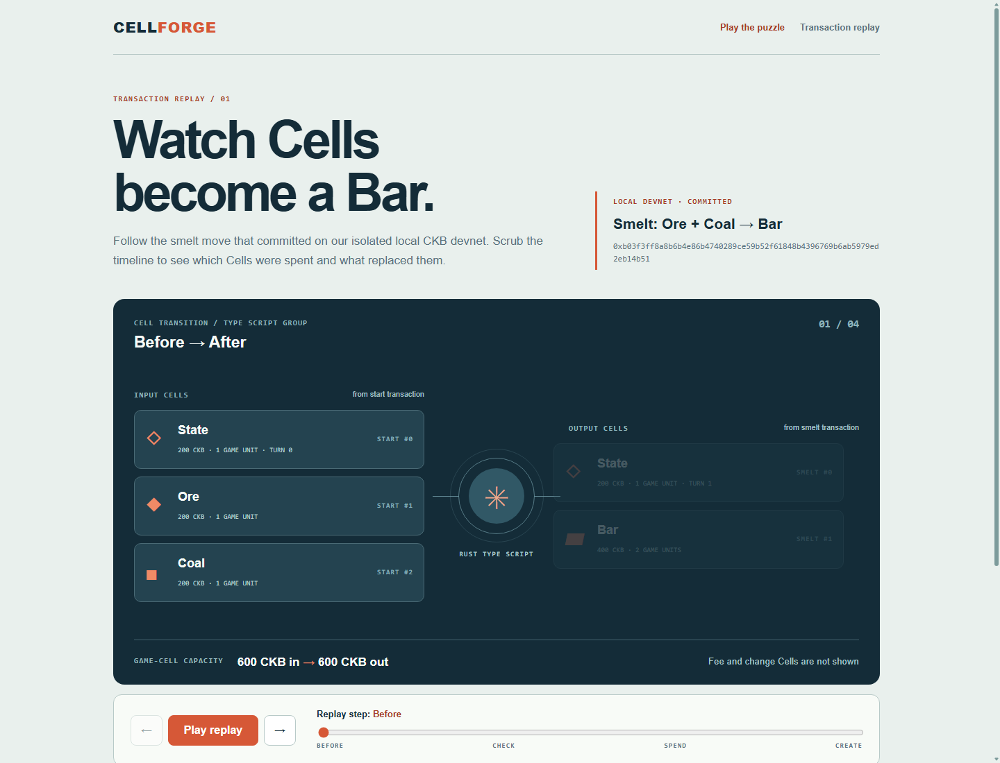
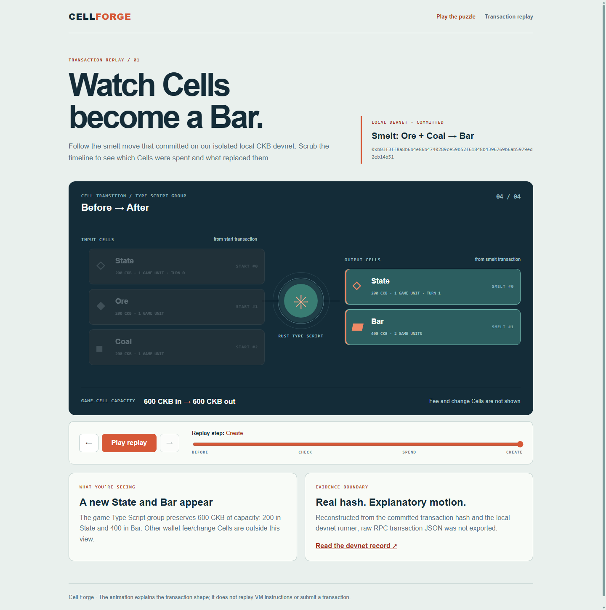
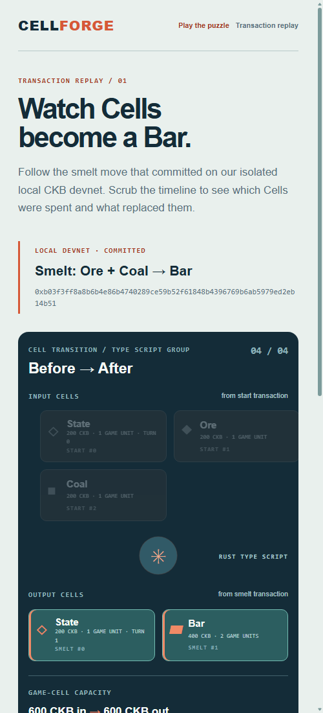
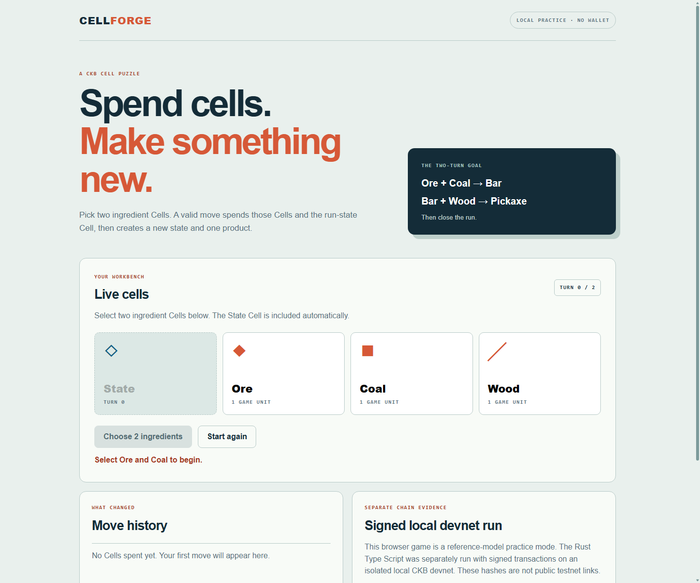
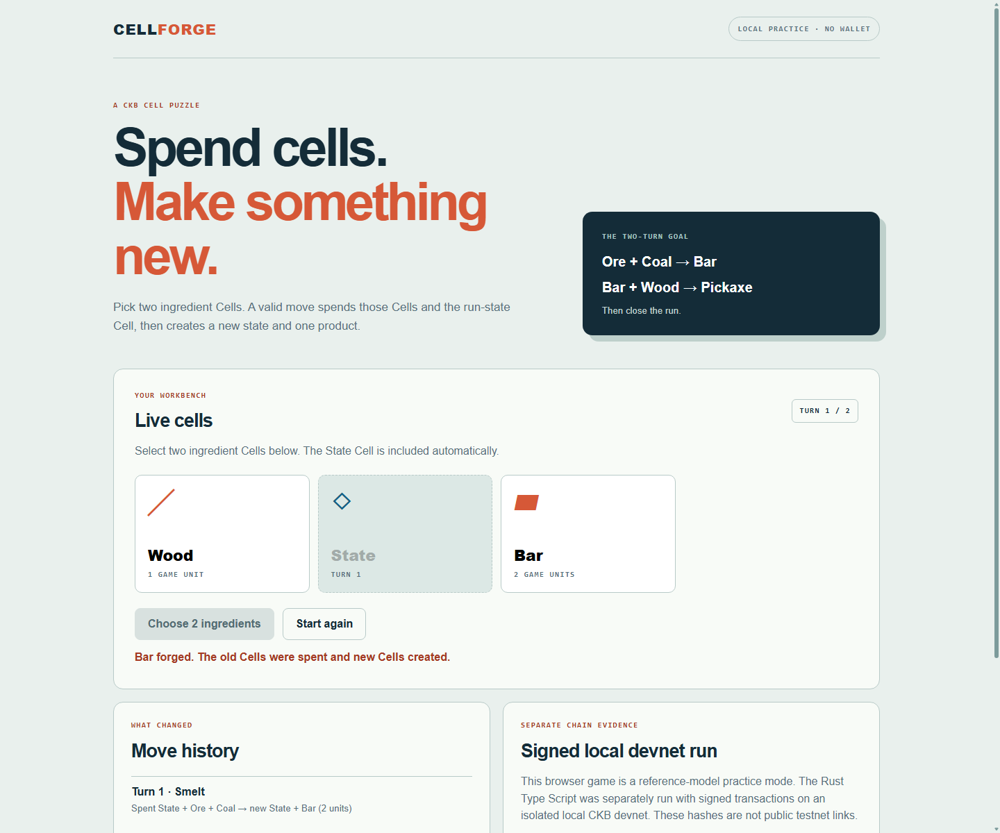
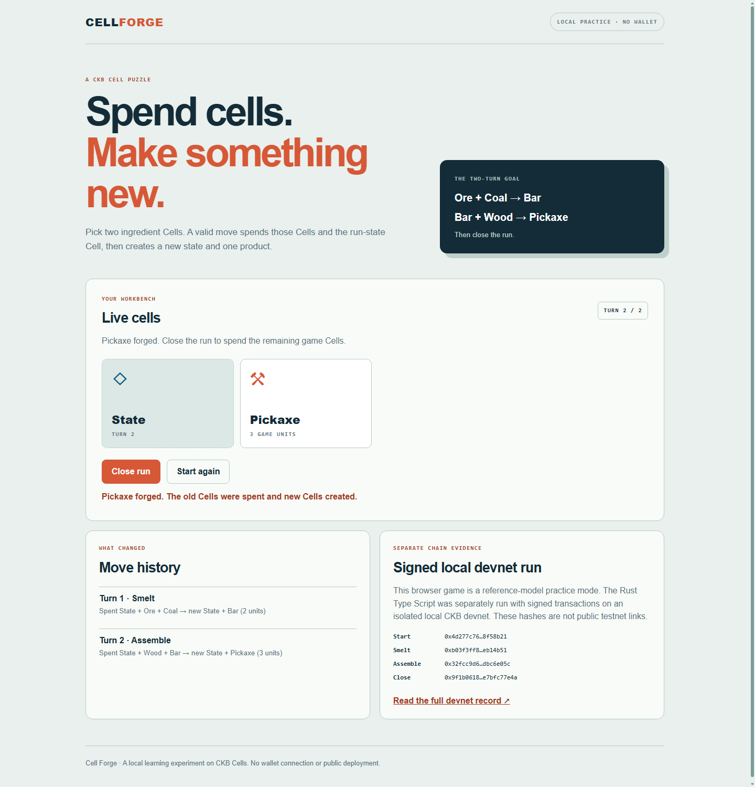

# Cell Forge

Cell Forge is a solo CKB Cell puzzle. The first level is Ore + Coal → Bar, then Bar + Wood → Pickaxe. The Rust contract has now completed a [signed local devnet run](DEVNET.md), but this is **not a public testnet game**.

The [Rust Type Script](rust-contract/README.md) handles start, both moves, and close in one artifact. Its CKB-VM tests pass, and those four steps committed on a local CKB devnet with a real signed Lock transaction. The CellScript version below remains a separate exploration and still has a combined-bootstrap compiler blocker.

You can play the two-turn puzzle in a browser. From `cell-forge/`, run `npm run web` and open `http://127.0.0.1:4173`. Select Ore and Coal, forge a Bar, then select Bar and Wood to forge a Pickaxe. Close the run or start again. The browser is **local practice only**: no wallet, node, or transaction submission. The move history shows game-Cell transitions, while the separate devnet panel links to the real signed local-chain record. `npm run play` remains available as a terminal version.

The first [transaction replay](web/replay.html) is at `http://127.0.0.1:4173/web/replay.html`. Play, pause, or scrub through the signed local-devnet smelt example. The visual shows the three game Cells consumed and two created, with their outpoint indexes, quantities, and game-group capacity. The transaction hash is real, but the Cell layout is reconstructed from [`scripts/devnet-run.mjs`](scripts/devnet-run.mjs); it is **not** a raw RPC export or VM instruction trace. Wallet fee/change Cells are intentionally outside this first view. Importing arbitrary transactions is not implemented yet.







These are screenshots of the running browser practice at the start, after smelting, and after assembling:







The dependency-free JavaScript model in `src/rules.js` describes the two-turn puzzle, including a run-state Cell. `src/forge.cell` verifies one pair recipe. The more complete `src/run.cell` consumes exactly one state Cell and two ingredients, then creates the next state Cell and product. Both use CellScript v0.31.0 `BoundedCellSet` and `BoundedList`, so extra Cells in the current Type Script group are rejected. `units` are game quantities, **not CKB capacity**. The artifacts enforce a 200 CKB output capacity floor; they do not prove exact CKB capacity conservation.

## Reproduce the current tests

Use WSL/Linux with Node.js 22 and CellScript `cellc` v0.31.0 on `PATH`. Set `CELLC` to its full path if needed. The version is pinned because later compilers may generate different artifacts.

```bash
npm ci
cellc --version  # must report 0.31.0
cellc src/forge.cell --target riscv64-elf --target-profile ckb --entry-action forge_pair -o build/forge-pair.elf
cellc src/run.cell --target riscv64-elf --target-profile ckb --entry-action forge_turn -o build/forge-turn.elf
cellc experimental/bootstrap-min.cell --target riscv64-elf --target-profile ckb --entry-action bootstrap_probe -o build/bootstrap-min.elf
cellc verify-artifact build/forge-pair.elf --verify-sources --json
cellc verify-artifact build/forge-turn.elf --verify-sources --json
cellc verify-artifact build/bootstrap-min.elf --verify-sources --json
cd rust-contract && cargo build --locked --release && cd ..
npm test
```

The CKB tests use `ckb-testtool`'s WASM CKB-VM debugger on mock transactions. They validate the Type Script, not a real wallet Lock, full node admission, or public testnet deployment. The input Lock fixture is `alwaysSuccess`; it must not be used to hold valuable assets. The policy also allows the signed transaction to choose different recipient Locks for the two outputs. A minimal output-only bootstrap now compiles and passes mock CKB-VM tests, but it has a **different Type Script identity** from the crafting artifact, so its Cells cannot be used to start the game. The full game still needs a single verified bootstrap-and-turn policy, secure run identity, and real wallet/node acceptance before anyone can play it on testnet. The attempted one-entry policy in `experimental/` currently fails CellScript's artifact-verification gate; it is not deployable.

Current local result: the pair policy passes two valid recipe cases and rejects eight malformed cases; the run policy passes both turns and rejects eight malformed cases. Pair successes measured 22,313 cycles; run successes measured 21,459 cycles. The verified run artifact is 5,968 bytes, hash `3f6ef368861a7bcf42f0bd2bfe3f8118b9c2b6850ccf4845de0b1b32c0bf0ad9`. These measurements are specific to the current mock fixtures and will be regenerated if the contract changes.
