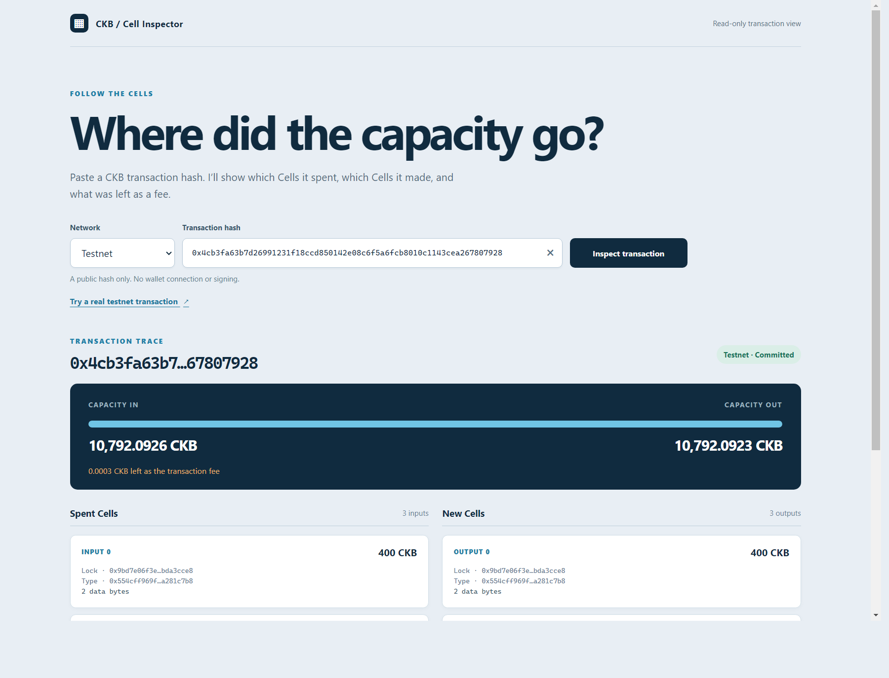
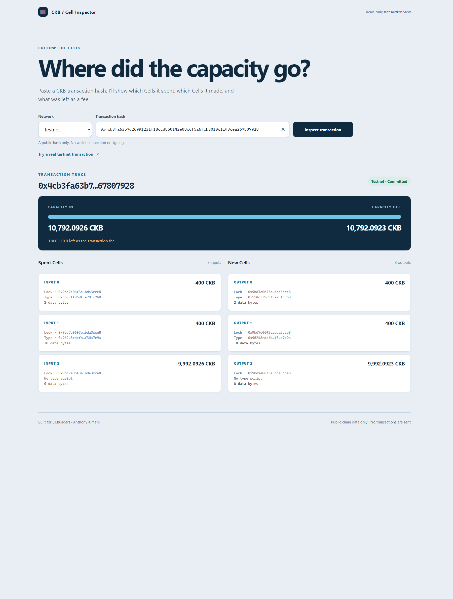

# CKB Builder Track - Week 7

Week Ending: 2026-09-29

## What I worked on

Last week I rebuilt part of my CellEscrow idea in CellScript. This week I tried to test it more like a real CKB transaction. I also built a second project, [CKB Cell Inspector](../../cell-inspector/), to help me see where a transaction's capacity actually goes.

## CellEscrow: a test I had missed

My earlier claim and refund tests each used one escrow Cell. I tried a claim with **two inputs using the same escrow type script**. The script checked the first one, but the second Cell could be paid to a different lock. The local CKB-VM test accepted that transaction. So the experimental [CellScript settlement script](../../cellscript-escrow/experimental/settle.cell) is **not safe to deploy**. I have not deployed it or used it with real funds.

I added a [transaction-level check](../../cell-escrow/src/protocol.js) to the JavaScript model. It counts inputs with the escrow type identity and rejects the transaction unless there is exactly one. The new test includes a second escrow input with a different lock, so checking the lock alone would not pass. All 10 JavaScript model tests pass.

This is a builder-side guard, not an on-chain fix. Someone could build a transaction without my JavaScript code. I could not make the pinned CellScript v0.25 script inspect every group input with the functions available to me, and the script also rejects creation of its first typed Cell. I am keeping that code under `experimental/`, not presenting it as a usable escrow. The honest next step is to work out an on-chain group check and creation path before using it.

## Project 2: CKB Cell Inspector

I wanted a small tool that would make the Cell model easier to inspect. The [viewer](../../cell-inspector/) takes a transaction hash, loads the transaction and each previous transaction from a public CKB RPC node, then shows the spent and created Cells side by side. It adds the input and output capacity and calculates the fee. If it cannot load a previous Cell, it says so and does not guess the fee.

I tested it with a [real testnet transaction](https://pudge.explorer.nervos.org/transaction/0x4cb3fa63b7d26991231f18ccd850142e08c6f5a6fcb8010c1143cea267807928). It has three inputs and three outputs. The RPC data gave me 10,792.0926 CKB in, 10,792.0923 CKB out, and a 0.0003 CKB fee. This is a read-only lookup of an existing transaction; the app does not connect a wallet or send one.

## Tests I ran

- CellEscrow JavaScript model: 10 passed, including the new two-escrow-input rejection.
- Cell Inspector: 4 passed, including fee calculation and the case where a previous Cell is unavailable.
- Live testnet RPC lookup: three inputs, three outputs, and a 30,000-shannon fee for the sample transaction.
- The CellScript CKB-VM fixture still accepts the two-escrow-input case. That is a failing safety check, not a passing contract test.

## What I learned

The escrow mistake was in the *transaction shape*, not the preimage check. A script group can contain more than the one Cell I happened to test. The inspector made that easier for me to see: every input points to an earlier output, and the fee is the difference between all input and output capacity. I now have a useful tool for looking at real transactions, while the escrow remains an experiment until its on-chain rules are fixed.
