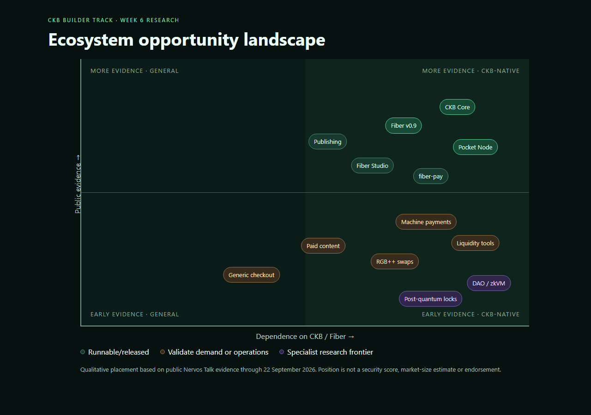

# CKB Builder Track — Week 6

Week Ending: 2026-09-14  
Research cut-off: 2026-09-22

## CKB Ecosystem 2026: From Technical Capability to Evidence of Demand

## Executive Summary

For Week 6, I stepped back from implementation and examined where the CKB ecosystem is actually moving. I reviewed recent Nervos Talk development logs, ecosystem updates, project announcements and Spark Program discussions. I also created a structured dataset covering 26 projects and infrastructure initiatives.

My conclusion is that CKB does not currently suffer from a shortage of technical ideas. Its more important gap is the distance between working prototypes and repeatable use.

Three trends stand out:

1. **CKB's base layer is in a hardening phase.** Recent work emphasizes security, transaction-pool reliability, indexing, node operations, light-client safety and contract tooling.
2. **Fiber is the ecosystem's main application-growth direction.** The largest concentration of new work involves channels, liquidity, payments, RGB++ swaps, machine payments and node tooling.
3. **The ecosystem has more demos than demand evidence.** Many projects have repositories, testnet flows or local prototypes. Far fewer show recurring users, payment volume, stable liquidity, retention or a maintained production route.

The best direction for my next project is therefore not another generic Fiber checkout. It is a narrow, evidence-led experiment around a user group with a recurring micropayment problem.

My proposed direction is:

> Research and validate whether Fiber can support low-value digital-service payments for developers, creators and machine-readable APIs in markets where cards and international payment processors are expensive or inaccessible.

The immediate next step is user discovery, not another large protocol build.

## Research Questions

1. What parts of CKB are currently shipping?
2. Which project categories are becoming crowded?
3. Where does public evidence stop at the prototype stage?
4. Which opportunities depend on properties distinctive to CKB or Fiber?
5. What should a builder validate before writing more code?

## Method

I reviewed public material available up to 22 September 2026:

- TeamCKB development logs;
- CKB Ecosystem Biweekly Updates;
- recent Nervos Talk application and infrastructure threads;
- Spark Program proposals, progress updates and committee feedback;
- the 2026 Fiber and machine-payment opportunity map;
- linked repositories, test logs and deployment evidence where the forum posts exposed them.

I classified 26 initiatives by category, CKB/Fiber dependence, public evidence, maturity and their main unresolved question. The complete dataset is in [research/week-six/ecosystem-projects.csv](../../research/week-six/ecosystem-projects.csv).

This is not a complete ecosystem census. Public forum activity overrepresents projects that publish frequent updates, and maturity labels are based only on public evidence. “Runnable testnet” does not mean audited, production-safe or adopted.

*Figure 1 — Qualitative placement by public evidence and dependence on CKB/Fiber. The chart is an opportunity map, not a security score or market-size estimate.*

## Finding 1 — The Base Layer Is Consolidating

CKB's recent engineering work is less about launching a new execution model and more about making the existing one dependable.

CKB v0.209.0 included fixes for memory growth, transaction-pool ancestor eviction, profiling and Tor connectivity. The same development cycle included light-client hardening, richer live-cell responses, contract-template improvements and continuing CKB-VM maintenance. Security received particular attention after more than one hundred bug-bounty reports were received over a two-month period.

This is healthy for the network, but it changes what an application builder should optimize for. The ecosystem does not need every new builder to create another lock-script demonstration. It needs applications and tooling that make the underlying capabilities usable and measurable.

Sources:

- [TeamCKB Dev Log](https://talk.nervos.org/t/teamckb-dev-log-updated-sep-16-2026/8572)
- [CKB Ecosystem Biweekly Update #22](https://talk.nervos.org/t/ckb-ecosystem-biweekly-update/9821/25)

## Finding 2 — Fiber Is the Current Center of Gravity

The latest ecosystem updates place Fiber at the center of application development:

- Fiber v0.9.0 and post-release work;
- Loop In/Out and liquidity-service-provider designs;
- a Fiber-enabled OffCKB development environment;
- fiber-pay and interactive tutorials;
- WebLN and browser-node experiments;
- channel readiness, rebalancing and liquidity operations;
- RGB++ asset swaps;
- spending permissions and payment sessions;
- merchant, content and machine-payment applications.

The direction is logical. CKB provides programmable settlement and asset ownership, while Fiber provides low-latency repeated payments.

However, this is also where duplication is highest. The public opportunity map documents multiple checkout, access-control, streaming, paid-content, AI-service and wallet projects. Two builder events produced 22 AI-agent submissions and 66 Fiber-infrastructure submissions. A new project must therefore do more than demonstrate that an invoice can be paid.

Sources:

- [CKB Ecosystem Biweekly Update #24](https://talk.nervos.org/t/ckb-ecosystem-biweekly-update/9821/28)
- [AI, machine payments, and Fiber in 2026](https://talk.nervos.org/t/ai-machine-payments-and-fiber-in-2026-an-opportunity-map-for-ckb-and-fiber-developers/10665)

## Finding 3 — Liquidity Is Both an Opportunity and a Warning

Channel liquidity appears repeatedly in current work:

- ChannelForge proposes payment-readiness intelligence.
- Sluice provides route probes, operator rebalancing, alerts and reconciliation.
- LiquidLane explores LP-backed channel liquidity.
- Fiber's roadmap includes Loop In/Out and LSP work.
- Automated rebalancing is an active research topic.

This concentration shows that liquidity is a real technical constraint. It also shows why a technically working protocol is not automatically a viable product.

Spark Program feedback on LiquidLane is particularly useful. The committee did not only ask whether its reserve-to-channel flow worked. It questioned where LP capital would come from, how custody would remain safe if an operator disappeared, and whether incentives could sustain liquidity.

> A protocol should not be described as solving liquidity merely because it can move liquidity.

It must also explain capital supply, custody, failure recovery, operator incentives and measurable demand.

Sources:

- [ChannelForge](https://talk.nervos.org/t/channelforge/10684)
- [LiquidLane](https://talk.nervos.org/t/liquidlane-lp-backed-fiber-channel-liquidity/10686)

## Finding 4 — Machine Payments Are Promising but Early

Machine payments are one of Fiber's most visible narratives. Existing work includes paid AI calls, inference marketplaces, agent-payment tools, streaming grants and routed payment-session proposals.

| Project pattern | Evidence currently visible | What remains uncertain |
| --- | --- | --- |
| Fixed-price paid AI call | Testnet demonstrations | Repeat demand and variable pricing |
| Agent payment tools | Repositories and local prototypes | Public routes, stable assets and production hubs |
| Streaming payments | Runnable prototypes | Persistent budgets and real service providers |
| Routed machine sessions | Early design discussion | Whether applications need a new session protocol |
| Paid content | Runnable experiments | Reader conversion and retention |

The strongest research opportunity is not “Can an AI agent send a payment?” That has already been demonstrated.

The better question is:

> Which machine-consumed service is valuable enough, frequent enough and cheap enough that Fiber materially improves the product?

Candidate services include inference, search, data feeds, storage, model evaluation and compute.

Sources:

- [AI, machine payments, and Fiber in 2026](https://talk.nervos.org/t/ai-machine-payments-and-fiber-in-2026-an-opportunity-map-for-ckb-and-fiber-developers/10665)
- [Routed Machine Payment Sessions on Fiber](https://talk.nervos.org/t/routed-machine-payment-sessions-on-fiber-looking-for-community-feedback/10694)

## Finding 5 — RGB++ and Stable Assets Matter

Native CKB is useful for network capacity and settlement, but many everyday payment products need a stable unit of account. The Fiber RGB++ Swap project is testing signed swap advertisements, gossip propagation and best-rate discovery across two nodes.

The project illustrates the difference between feature completion and market completion. Signed advertisements and working discovery are measurable technical milestones. Remaining questions include atomic exchange correctness, rate reliability, liquidity depth, security and which assets users will actually demand.

For product research, interviews must ask:

- What currency does the seller price in?
- What asset can the buyer acquire?
- Who absorbs exchange-rate risk?
- How does liquidity enter and leave the channel?
- What happens when no route supports the required asset?

Source:

- [Fiber RGB++ Swap progress report](https://talk.nervos.org/t/spark-program-fiber-rgb-swap/10487/26)

## Finding 6 — Tooling Is Improving, but Claims Need Verification

Developer experience remains a large category:

- OffCKB is adding a Fiber development network.
- Orbital offers a development and deployment environment.
- CKScope is developing a local-first CCC-native explorer.
- CellScript is building a language, package interface, upgrade checks and artifact verification.
- Spark Verify proposes reproducible acceptance checks.

CellScript is notable because it targets correctness boundaries rather than only syntax. Version 0.25 added interface-diff checks across source APIs, serialized layouts, runtime ABI and deployment contracts. Version 0.30 is still a release candidate and explicitly measures the cost of its abstractions.

The Spark committee's rejection of a mobile SDK proposal also provides an important lesson. The proposal claimed developers had to create Android bridges from scratch, but the committee pointed to an existing combination demonstrated by Pocket Node. Research must check existing implementations before presenting a gap as new.

Sources:

- [CellScript 0.25](https://talk.nervos.org/t/cellscript-a-dsl-for-cell-based-contracts/10193/32)
- [CellScript 0.30 release candidate](https://talk.nervos.org/t/cellscript-0-30-abstractions-bytes-and-the-cost/10732)
- [CKB-Mobile-Core review](https://talk.nervos.org/t/ckb-mobile-core-lightweight-native-mobile-sdk-for-ios-android/10683)

## Finding 7 — Governance and Security Are Specialized Frontiers

Other substantial directions include:

- zkVM-assisted DAO voting and treasury settlement;
- post-quantum SHRINCS locks and wallet prototypes;
- zk-locks;
- reproducible CKB-VM semantic validation;
- programmable wallet recovery;
- privacy and collaborative channel funding.

The DAO voting work suggests zkVM verification is feasible under the UTXO model, but proof performance and settlement design remain research problems. These areas require more cryptographic and protocol expertise than a one-week builder project should pretend to possess.

Sources:

- [Activating the Nervos DAO Treasury](https://talk.nervos.org/t/pre-rfc-discussion-activating-the-nervos-dao-treasury/10143)
- [Research Notes: What Zero-Knowledge Proofs Enable on CKB](https://talk.nervos.org/t/research-notes-what-zero-knowledge-proofs-enable-on-ckb/10368/3)

## Ecosystem Maturity Matrix

| Area | CKB/Fiber dependence | Prototype activity | Adoption evidence | Builder interpretation |
| --- | --- | --- | --- | --- |
| Generic Fiber checkout | High | High | Low | Crowded; reuse existing components |
| Paid content | Medium | Medium | Low | Validate willingness to pay first |
| AI/API micropayments | High | High | Early | Promising if tied to a real service |
| Liquidity operations | High | High | Early | Important but operationally difficult |
| RGB++ swaps | High | Medium | Early | Core enabling infrastructure |
| Contract languages/tooling | High | Medium | Early | Valuable public-good work |
| Mobile/light clients | High | Medium | Emerging | Check existing SDKs before building |
| DAO/zkVM governance | High | Low | PoC-stage | Research frontier; specialist work |
| Post-quantum accounts | High | Low | Prototype-stage | Long-horizon strategic research |
| Publishing/social apps | Medium | Medium | Limited | Retention matters more than storage |

## Where Builders Should Head

The ecosystem should move from **capability demonstrations** toward **evidence-driven products**:

1. Reuse Fiber payment and node components instead of rebuilding them.
2. Choose a narrow group of users with a repeated payment problem.
3. Decide the settlement asset and liquidity path before designing the interface.
4. Measure successful payments, failure rates, repeat usage and provider retention.
5. Publish negative evidence when the proposed market does not materialize.
6. Treat security, custody and recovery as product requirements.
7. Keep CKB-specific value explicit.

## Recommended Research Direction

### Fiber Payments for Small Digital Services

My next direction should investigate whether Fiber can improve payment access for:

- freelance developers selling small deliverables;
- creators selling individual digital items;
- API providers charging per request;
- AI tools purchasing inference, search or data;
- users poorly served by card minimums and cross-border fees.

### Hypotheses

1. Some digital services are too small for conventional international payment fees.
2. Providers would accept instant digital-asset settlement if conversion and custody were simple.
3. Buyers care more about predictable fiat value than the specific token used.
4. Fiber's advantage becomes meaningful for repeated payments, not one-off large purchases.
5. Onboarding, liquidity and asset acquisition may be larger barriers than latency.

### Evidence required before building

- At least ten interviews across buyers and providers.
- Three recurring service types with actual price ranges.
- A comparison of cards, mobile money, Lightning, stablecoin transfers and Fiber.
- A documented asset-acquisition path.
- A minimal payment route tested on a named network.
- Explicit success criteria such as repeat payment intent or lower effective fees.

## Proposed Week 7 Experiment

If interviews support the hypothesis, Week 7 should build a narrow metered API payment pilot:

    API request
        ↓
    payment requirement
        ↓
    Fiber payment
        ↓
    signed access receipt
        ↓
    single API response

The pilot should reuse existing Fiber tooling and measure time to first payment, effective fee, failure reasons, repeat-call behavior, provider reconciliation and user understanding of the asset.

If interviews do not support the hypothesis, that is still useful. The research should redirect the project instead of forcing a predetermined product.

## Limitations

- The inventory is a purposive sample, not a complete census.
- Public repositories and testnet logs do not prove production security.
- Forum activity does not equal user adoption.
- Project status changes quickly.
- I have not yet conducted the proposed user interviews.
- Market conclusions remain hypotheses until buyers and providers validate them.

## Final Reflection

Weeks 1–5 taught me how CKB cells, scripts and Fiber payment flows can work. Week 6 changed the question from “What can I build?” to “What is worth building?”

CKB is hardening, Fiber is expanding, and builders are producing many payment and infrastructure prototypes. The next valuable contribution is evidence that a specific group of users has a recurring problem that CKB and Fiber solve better than the alternatives.

That is where I should head next.
