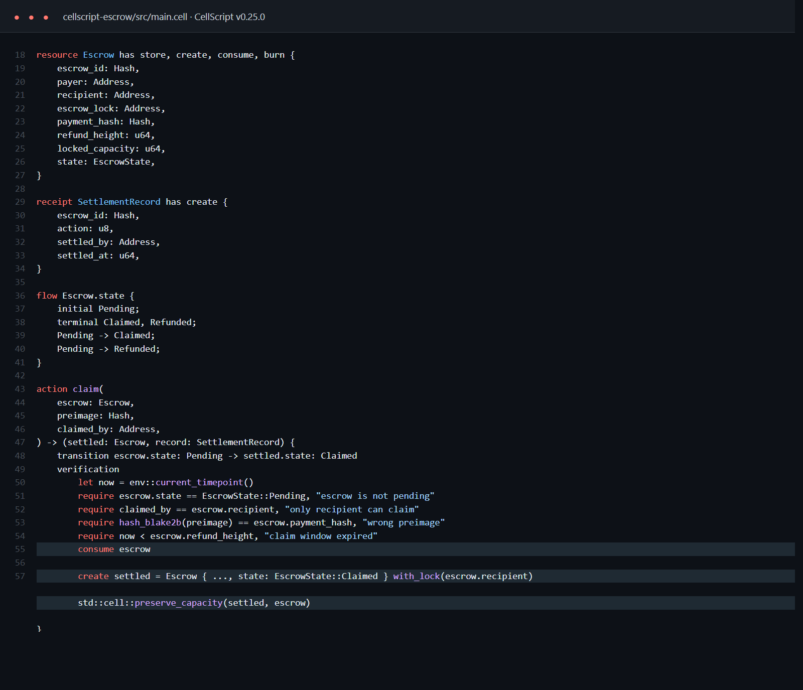
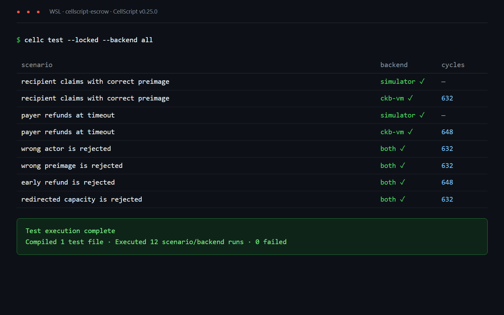
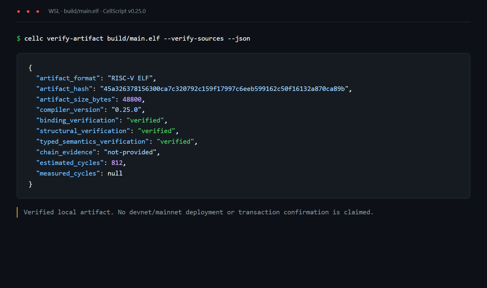

# CKB Builder Track - Week 6

Week Ending: 2026-09-14

## What I wanted to understand

This week I looked into [CellScript](https://github.com/CellScript-Labs/CellScript), a language for writing CKB contracts around cells, actions and state changes.

I wanted to see if it could make the CellEscrow rules easier to express than the JavaScript model I built in Week 3. I kept the scope small: the recipient can claim with the correct preimage, or the payer can refund after a block height. The same capacity must leave the escrow that entered it.

I used CellScript `v0.25.0` because it is the current stable release. There is a `v0.30` release candidate, but I did not use it for this exercise.

## Reading completed

- [CellScript README and v0.25.0 release](https://github.com/CellScript-Labs/CellScript/tree/v0.25.0)
- [CellScript 0.25 update](https://talk.nervos.org/t/cellscript-a-dsl-for-cell-based-contracts/10193/32)
- [CellScript 0.30 release candidate discussion](https://talk.nervos.org/t/cellscript-0-30-abstractions-bytes-and-the-cost/10732)
- The bundled `atomic_swap.cell`, `timelock.cell` and executable scenario examples
- [Verified artifacts and executable tests](https://www.cellscript.dev/docs/tutorial-14-verified-artifacts-and-executable-tests/)

The main idea is that a contract is written in terms of resources and explicit effects. `consume` spends an input resource, `create` checks an output resource, and a `flow` limits the allowed state changes.

## Rebuilding part of CellEscrow in CellScript

The new project is in [`cellscript-escrow/`](../../cellscript-escrow/).

I represented the agreement as one `Escrow` resource containing the payer, recipient, payment hash, refund height, capacity and state. Its flow has only two valid paths:

```text
Pending -> Claimed
Pending -> Refunded
```

The `claim` action checks that the `claimed_by` witness value is the recipient, the BLAKE2b hash of the preimage matches, and the refund height has not been reached. The `refund` action checks that the `refunded_by` witness value is the payer and the refund height has been reached.

Both actions consume the pending escrow and create a terminal escrow Cell locked to the correct person. I used `std::cell::preserve_capacity(settled, escrow)` to make CellScript compare the real input and output Cell capacities. This was better than only storing a number in the Cell data.



One difference from the Week 3 JavaScript model is the hash function. That prototype used SHA-256. This CellScript version uses the built-in CKB BLAKE2b helper, so it is an evaluation of the same claim/refund shape, not a byte-for-byte port.

## Tests I ran

I wrote six scenarios:

| Scenario | Expected result |
| --- | --- |
| Recipient claims with the correct preimage | Pass |
| Payer refunds at the refund height | Pass |
| Wrong actor tries to claim | Reject |
| Recipient gives the wrong preimage | Reject |
| Payer refunds one block early | Reject |
| Settlement changes the capacity | Reject |

I ran every scenario with the simulator and the CKB-VM backend:

```bash
cellc test --locked --backend all
```

The result was 12 successful scenario/backend runs and no failures. The CKB-VM runner measured 632 cycles for the claim cases and 648 cycles for the refund cases.



I also built and verified the generated RISC-V ELF:

```bash
cellc build --locked
cellc verify-artifact build/main.elf --verify-sources --json
```

Details:

- Compiler: `cellc 0.25.0`
- Artifact format: RISC-V ELF
- Artifact size: `48,800` bytes
- Artifact hash: `45a326378156300ca7c320792c159f17997c6eeb599162c50f16132a870ca89b`
- Source binding: verified
- Structural verification: verified
- Typed semantics verification: verified
- Capacity-preservation runtime checks: 2



## What was easier than JavaScript

The state change is easier to read. In the JavaScript version I had to decode the data, check the witness, compare the signer, check the output and return my own error codes. CellScript lets me write the transition beside the checks:

```cell
transition escrow.state: Pending -> settled.state: Claimed
```

It also makes the Cell effects obvious. I can see which resource is consumed, which output is created and which lock receives the settled Cell. The generated metadata lists those input and output requirements, which is useful when checking what the compiler thinks the contract does.

The capacity check was a good example. My first attempt compared a `locked_capacity` field in the data. The verified build rejected the way I tried to apply `preserve_capacity` to a different output type. I changed the design to create a terminal `Escrow` successor of the same type. After that, the compiler produced two real capacity-preservation checks, one for claim and one for refund.

## Problems and limitations

CellScript is still marked as alpha/stabilisation software. Its own documentation says it is for experimentation and is not recommended for unaudited mainnet deployment.

The executable scenario runner also has a boundary. The simulator can execute typed entries, while the v0.25.0 CKB-VM scenario runner only executes no-argument entries unless a separate stateful transaction harness is provided. My six scenarios exercise the same actor, preimage, timelock and capacity decisions as the contract, but they do not load a full CKB transaction with real inputs, outputs and witnesses.

There is also an authorization boundary I have not completed. The pending Cell is assigned to a dedicated `escrow_lock`, but this project does not implement that lock or verify a payer/recipient signature. `claimed_by` and `refunded_by` are witness values checked by the type transition; they are not cryptographic proof of who signed. A production escrow needs both layers connected.

The CKB-VM cycle numbers above are for those small rule scenarios. They are not the measured cost of a complete escrow settlement transaction. The artifact verifier reports chain evidence as `not-provided` and requires a dry run before production use.

I did not deploy this contract to devnet or mainnet, so there is no transaction hash for this week. The project is also not audited.

## What I learned

- CellScript maps well to contracts that are naturally described as Cell state transitions.
- `resource`, `consume`, `create` and `flow` make the lifecycle easier to follow than manual data parsing.
- A value saved in Cell data is not the same thing as the actual Cell capacity. `std::cell::preserve_capacity` is the important check here.
- The compiler can generate a RISC-V ELF plus metadata about entries, Cell access, runtime requirements and output checks.
- Passing simulator tests is useful, but it is not chain evidence.
- Running a no-argument rule on CKB-VM is also not the same as testing a full transaction syscall path.
- Pinning the compiler matters because CellScript is changing quickly. This project is fixed to `v0.25.0`.

This exercise gave me a better picture of where CellScript helps and where the builder still has work to do. The contract reads closer to the escrow rules I had in mind, but a proper deployment would still need a transaction builder, stateful CKB test vectors, occupied-capacity measurements, a dry run and a security review.
