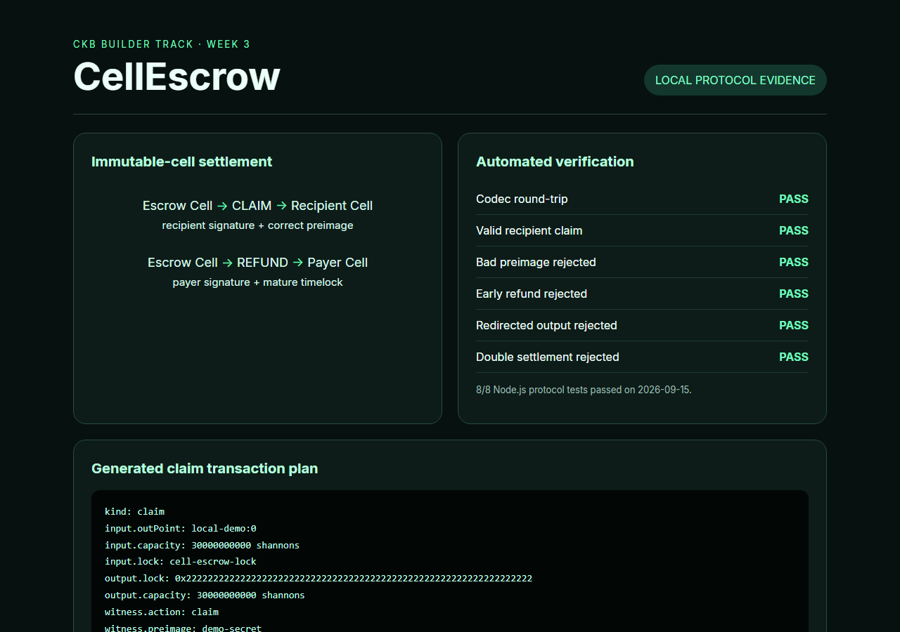

# CKB Builder Track — Week 3

Week Ending: 2026-08-24

## Theme: Designing State with Immutable Cells

Weeks 1 and 2 taught me how cells work and how a lock script controls consumption. This week I stopped treating those ideas as separate tutorials and designed a protocol around them: **CellEscrow**, a conditional payment agreement represented by one live CKB cell.

## Project Delivered

| Deliverable | Status | Location |
| --- | --- | --- |
| Versioned escrow cell codec | Complete | `cell-escrow/src/codec.js` |
| Claim/refund validation model | Complete | `cell-escrow/src/protocol.js` |
| Create/claim/refund transaction plans | Complete | `cell-escrow/src/transactions.js` |
| Live-cell discovery model | Complete | `cell-escrow/src/indexer.js` |
| Adversarial lifecycle tests | 8 passing | `cell-escrow/test/` |
| Devnet ckb-js-vm deployment | Not yet executed | `cell-escrow/DEPLOYMENT.md` |

## Protocol Design

Each escrow agreement is one cell whose capacity is the payment, whose lock is the escrow validator, and whose 105-byte data payload contains a schema version, payer identity, recipient identity, payment hash and refund block number.

The agreement has two legal exits:

```text
                    live escrow cell
                    /              \
 recipient + preimage                payer + mature timelock
         /                              \
    CLAIM                                  REFUND
      |                                       |
recipient-owned cell                    payer-owned cell
```

The validator checks the authorization, condition and destination together. A valid preimage alone is not enough: the recipient must sign and the output must pay the recipient. Likewise, a mature timelock alone does not allow arbitrary spending: the payer must sign and receive the output.

## Important Design Decisions

### State belongs in the cell

The durable agreement fields live in cell data because they must be committed on-chain and available to validation. The preimage lives in the witness because it only matters during settlement. Application indexes are derived views of live cells, not the source of truth.

### Fees should not reduce the promised payment

The validation model requires the settlement output to preserve the escrow capacity. A production transaction should add a normal signer-owned input to pay the network fee. This avoids silently charging the recipient or changing the agreement amount.

### Double settlement is a property of the Cell Model

Once the agreement cell is consumed, its outpoint is no longer live. The index model tests this explicitly: a second attempt to consume the same outpoint fails. No mutable `settled = true` field is required.

### The schema is versioned

Byte zero is a version. That small choice gives a deployed reader a safe way to reject or route future data layouts instead of guessing.

## Verification



*Figure 1 — Executed local evidence: the CellEscrow test suite and generated claim transaction plan. This is not presented as an on-chain transaction.*

Running `npm test` inside `cell-escrow/` covers:

- cell-data encoding and decoding;
- successful recipient claim;
- rejection of a bad preimage;
- rejection of a claim by the payer;
- rejection of an early refund;
- successful refund at maturity;
- rejection of a redirected output;
- rejection of a second settlement.

These are local protocol-model tests. I have intentionally not included a fake deployment hash: the ckb-js-vm syscall adapter, devnet deployment and real transaction evidence remain in the deployment checklist.

## What I Learned

The central lesson is that a CKB application does not need a contract-owned map of escrow IDs to status values. The live-cell set already answers which agreements exist. A transaction proves the transition by consuming the old state and creating the allowed ownership state.

I also learned that protocol design is more than verifying a secret. Output constraints are equally important; otherwise a transaction could satisfy the condition while sending the capacity somewhere unintended.

## Next Step

Week 4 moves from on-chain conditional settlement to Fiber. The goal is to understand what changes when repeated payments happen in channels while CKB remains the settlement layer.
